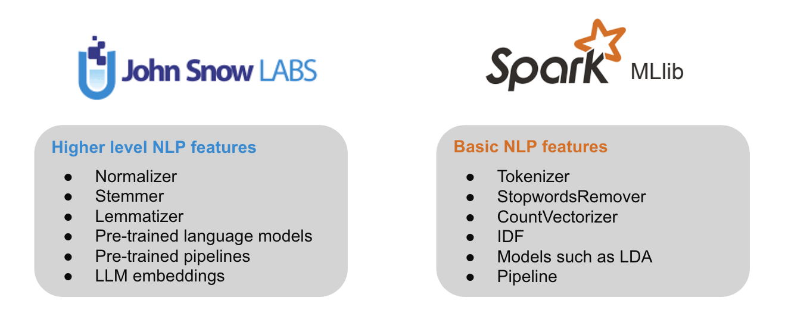
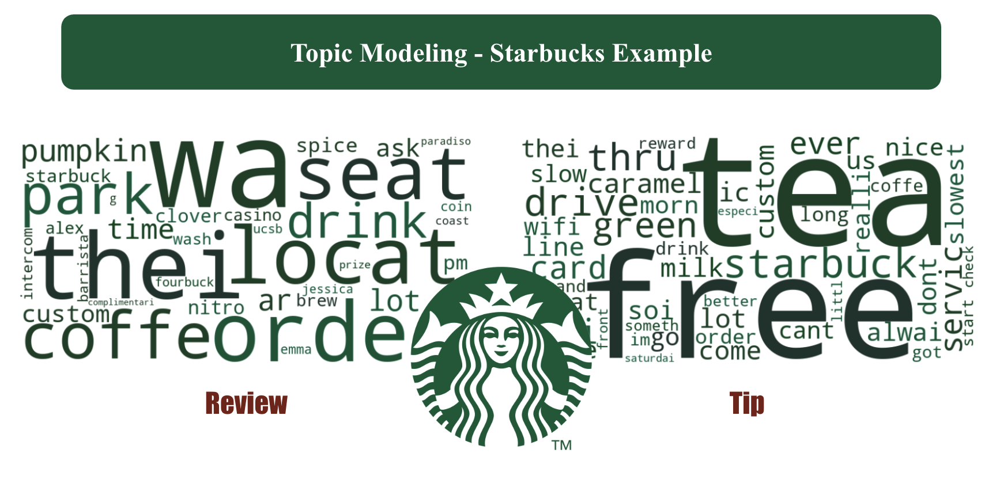

# Spark-NLP-on-Yelp-Dataset
-- Yuanshan Zhang, Ananya Anand, Shubham Mishra, Shizuka Takahashi, Ruiqi Jiang

The Yelp dataset consists of 5 JSON files: business (113.4MB), review (4.98GB), tip (172.2MB), user (3.13GB), and checkin (273.7MB), covering 150,346 businesses, 6,990,280 reviews, 908,915 tips by 1,987,897 users, and aggregated check-ins over time for each of the 131,930 businesses. The purpose of this project is to derive insights from the dataset to help businesses to improve their services.

Source: https://www.yelp.com/dataset/documentation/main

# What I did
**1. Research on third-party libraries**\
Since our data contains 7 millions reviews, NLP becomes the most important aspect of our analysis. However, Spark MLlib only offers limited and lower level NLP features such as tokenizer, StopwordsRemover, etc. Applying higher level NLP techniques with high efficiency becomes the biggest challenge in our project. After researching on third party libraries, I decided to use Spark NLP, which is an open-source NLP library developed by John Snow Labs. Spark NLP is built on top of Apache Spark and TensorFlow and offers a range of higher level features such as normalizer, stemmer, lemmatizer, pre-trained language models, LLM embeddings, etc.



**2. Prepare data and create PySpark cluster in Dataproc**\
First, I download the data from Yelp and upload to the Cloud Storage on GCP(Google Cloud Platform). To use Spark NLP, I configured the cluster using the cloud shell by referring to https://github.com/JohnSnowLabs/spark-nlp/tree/master/python#gcp-dataproc:
```bash
gcloud dataproc clusters create <cluster_name> \
  --region=us-east1 \
  --zone=us-east1-b \
  --image-version=2.1-debian11 \
  --master-machine-type=e2-highmem-4 \
  --worker-machine-type=e2-highmem-2 \
  --master-boot-disk-size=50GB \
  --worker-boot-disk-size=50GB \
  --num-workers=2 \
  --bucket=<bucket_name> \
  --optional-components=JUPYTER \
  --enable-component-gateway \
  --metadata 'PIP_PACKAGES=spark-nlp spark-nlp-display google-cloud-bigquery google-cloud-storage' \
  --initialization-actions gs://goog-dataproc-initialization-actions-us-east1/python/pip-install.sh \
  --properties spark:spark.serializer=org.apache.spark.serializer.KryoSerializer,spark:spark.driver.maxResultSize=0,spark:spark.kryoserializer.buffer.max=2000M,spark:spark.jars.packages=com.johnsnowlabs.nlp:spark-nlp_2.12:5.3.3
```

**3. Topic modeling**\
In general, topic modeling refers to the broad task of assigning topics to unlabeled text documents, and the model I pick is the Latent Dirichlet Allocation(LDA), which is a generative probabilistic model that takes Bag of Words or TF-IDF as input, finds groups of words that appear frequently together across different documents, and output probabilistic distribution of the topics.

Before building the model, I first remove special characters from the text. Then, I filtered the reviews and tips for Starbucks to demonstrate how to generate insights for businesses by topic modeling. After training the model, I extracted 5 terms as the topic for each document as created a word cloud: 


We observe that in the review dataset, many reviews are centered around ‘pumpkin spice’ and ‘nitro brew’. So, we would recommend Starbucks to pay special attention to the reviews of these two products. In the tip dataset, there are many tips centered around ‘wifi’, ‘park’, ‘free’, and ‘slow’, so we can help Starbucks to develop business strategies such as improving app ordering services and providing free wifi to keep and attract customers.

**4. Sentiment Analysis**\
Precise sentiment analysis plays a crucial part in helping business refining their services. However, it is quite a challenge to train a well functional deep learning model from strach since we have 7 million reviews and limited computational power as well as hardware. Therefore, using a pre-trained model is a commercial and feasible resoluation.

The pre-trained model I picked was 'sentimentdl_use_imdb' from Spark NLP. It is trained on classifying IMDB reviews in negative, positive, and neutral categories using `Universal Sentence Encoder`. Reason for choosing this model is because the length and tone of IBDM reviews are very similar to Yelp reviews
